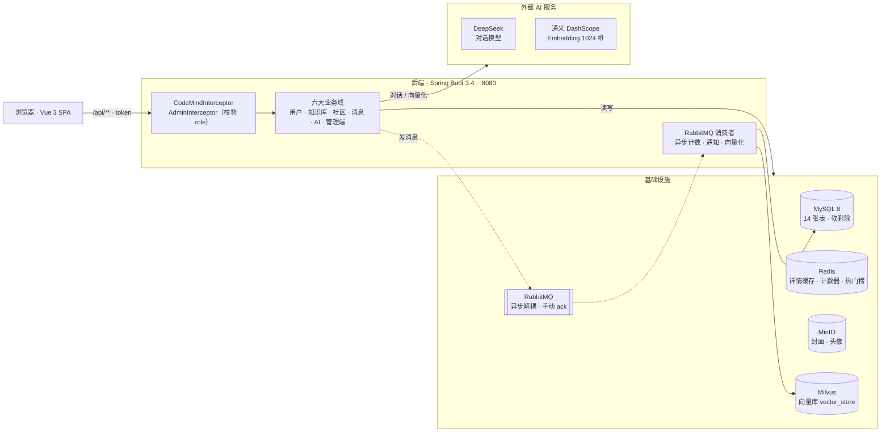
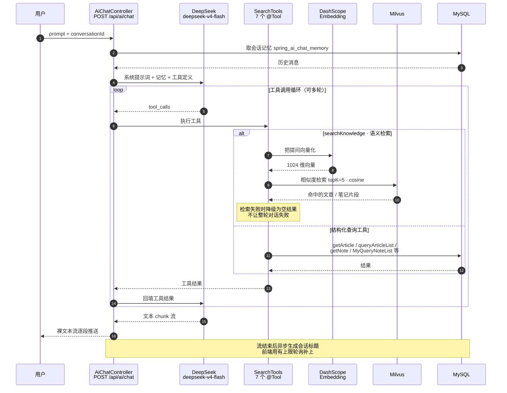
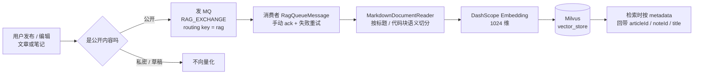

# CodeMind 架构与 AI 流程

> 本文用 Mermaid 绘制，GitHub 会直接渲染成图。想看大图可以复制到
> [mermaid.live](https://mermaid.live) 导出 PNG / SVG。

---

## 一、项目架构

四层结构：**客户端 → 后端（鉴权 + 六大业务域 + MQ 消费者）→ 基础设施 → 外部 AI 服务**。

> 业务域原有五个（用户 / 知识库 / 社区 / 消息 / AI 助手），
> **2026-10 新增管理端**（看板 / 用户治理 / 内容治理 / 死信队列），
> 它走**独立的鉴权层**（`AdminInterceptor` 额外校验 `role`），与业务域的鉴权并存。

**几个关键点**

| 设计 | 说明 |
|---|---|
| 鉴权 | `CodeMindInterceptor` 读请求头 **`token`**（不是 `Authorization`），把 userId 放进 `UserContext`（ThreadLocal），请求结束清理 |
| 管理端鉴权 | `/api/admin/**` 额外挂 **`AdminInterceptor`**：在 token 校验之外**每次请求查库**取 `role` 并校验 `= 1` —— 用「每次查库」换「改角色立即生效」。**非管理员返回真 HTTP 403**，其余错误仍是 HTTP 200 + `code` |
| 死信可运维 | 死信队列做成接口（查看 / 清空 / 重投）：查看用 `basicGet` 读完**不确认、重新入队**（只读）；重投回**原交换机**而非 DLX（投 DLX 会死循环） |
| 缓存 | 文章详情 Cache Aside（`codemind:article:detail:{id}`）；浏览量 / 点赞数 / 热门榜都走 Redis，异步落库 |
| 异步 | 计数、通知、RAG 向量化都走 RabbitMQ —— 写接口不等待这些副作用 |
| 软删除 | 全表 `is_delete` + MyBatis-Plus `@TableLogic`，查询自动带 `is_delete = 0` |
| 无外键 | 引用完整性由应用层校验，便于后续分库分表 |

---

## 二、AI Agent / Tool / RAG 流程

### 2.1 一次对话的完整链路

`POST /api/ai/chat` 返回的是 `Flux<String>` **裸文本流**（不是 JSON、也不是 SSE）。
模型可以在一轮里多次调用工具，工具结果回填后再继续生成。

### 2.2 RAG 的写入链路（向量化）

向量化**不在写接口里同步做** —— 发布 / 编辑时只发一条 MQ 消息，由消费者异步完成。
**只有公开内容会被向量化**（私密笔记、草稿不进向量库）。

**为什么这样设计**

| 点 | 说明 |
|---|---|
| 异步 | Embedding 是外部网络调用（秒级），放进写接口会拖慢发布；用 MQ 解耦后发布立刻返回 |
| 幂等 | 消费者用 `uuid` 做 Redis `setIfAbsent` 去重（TTL 1 分钟），重投不会重复向量化 |
| 重试 | 失败自动 requeue，超过 3 次丢弃并记日志（避免死循环） |
| 切分 | `MarkdownDocumentReader` 按 Markdown 语义切 —— 一篇长文会变成多条向量，检索粒度更细 |
| 只公开 | 私密笔记 / 草稿永不进向量库，避免越权泄漏 |

---

## 三、AI 工具清单

模型可用的 7 个 `@Tool`（`ai/tools/` 下三个类）：

| 工具 | 作用 | 数据来源 |
|---|---|---|
| `searchKnowledge` | 语义检索文章 + 笔记 | **Milvus 向量库**（RAG） |
| `getArticle` | 按 id 取文章详情 | MySQL |
| `queryArticleList` | 按关键词 / 作者 / 标签查文章列表 | MySQL |
| `getNote` | 按 id 取笔记详情 | MySQL |
| `queryNoteList` | 查公开笔记列表 | MySQL |
| `MyQueryNoteList` | 查当前用户自己的笔记 | MySQL |
| `RecommendRelatedContentTools` | 推荐相关内容 | MySQL |

> ⚠️ `searchKnowledge` 是**唯一会发外部网络请求**的工具（要先做 Embedding），
> 因此也是最容易被瞬时抖动打中的。它内部做了兜底：检索失败时返回空结果并记 warn，
> 让模型降级到「结构化查询工具 + 自身知识」继续回答，而不是让整轮对话失败。
